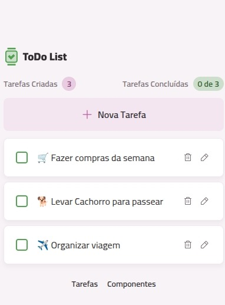

# Todo App

Este projeto é uma aplicação de lista de tarefas desenvolvida com React, TypeScript e Vite. A interface permite adicionar, visualizar e gerenciar tarefas de forma simples e rápida, com uma experiência limpa e responsiva.

## Demonstração

A imagem abaixo mostra a aplicação em funcionamento:



## Funcionalidades

- Cadastro de novas tarefas
- Listagem das tarefas criadas
- Resumo das tarefas cadastradas
- Persistência das tarefas no armazenamento local do navegador
- Interface moderna com componentes reutilizáveis

## Tecnologias utilizadas

- React
- TypeScript
- Vite
- Tailwind CSS
- React Router
- use-local-storage

## Pré-requisitos

Antes de começar, certifique-se de ter instalado:

- Node.js 18 ou superior
- pnpm

## Instalação

Clone o repositório e instale as dependências:

```bash
git clone https://github.com/anacnogueira/react-todo.git
cd react-todo
pnpm install
```

## Executando o projeto

Inicie o servidor de desenvolvimento:

```bash
pnpm dev
```

A aplicação ficará disponível em:

```text
http://localhost:5173
```

## Build para produção

Para gerar a versão otimizada para produção:

```bash
pnpm build
```

Os arquivos prontos para publicação serão gerados na pasta dist.
